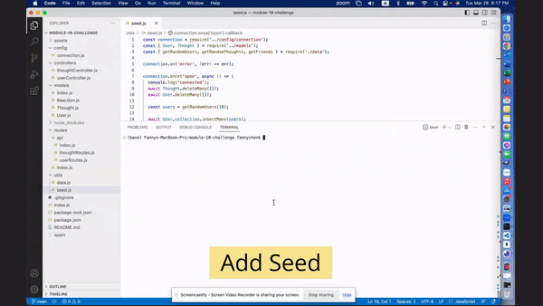

# Module 18 Challenge - NoSQL: Social Network API

>**Application Video:** [Social Network API](https://drive.google.com/file/d/1wa7WvYBFWWmXrK4Y7dfjs0y99e_dl15K/view?usp=share_link)
>
>**View:** [Description](#description) / [Application Details](#application-details) / [Application Sample Runs](#application-sample-runs)
>
>**Application Preview:**
>
>
> 
## **DESCRIPTION**
> Topic Assessed: **MongoDB & Mongoose**
### **My Task**
*Social Network API* is a node js application that allows users to share their thoughts, react to friends’ thoughts, and create a friend list.
> Create application from scratch.
> 
> Complete the database models with the defined requirements listed for each model.
>
> Create seed data to populate database on MongoDB server.
>
> Complete the API routes to Perform RESTful CRUD Operations.
>
> Sync MongoDB to the Database on Server Start.
> 
## User Story
```
AS A social media startup
I WANT an API for my social network that uses a NoSQL database
SO THAT my website can handle large amounts of unstructured data
```
## Acceptance Criteria
```
GIVEN a social network API
WHEN I enter the command to invoke the application
THEN my server is started and the Mongoose models are synced to the MongoDB database
WHEN I open API GET routes in Insomnia for users and thoughts
THEN the data for each of these routes is displayed in a formatted JSON
WHEN I test API POST, PUT, and DELETE routes in Insomnia
THEN I am able to successfully create, update, and delete users and thoughts in my database
WHEN I test API POST and DELETE routes in Insomnia
THEN I am able to successfully create and delete reactions to thoughts and add and remove friends to a user’s friend list
```
## **APPLICATION DETAILS**
### models Information
* **User.js**:
  * `username`: string, required, unique, trim 
  * `email`: string, required, unique, validate email
  * `thoughts`: id, reference: Thought
  * `friends`: id, reference: User
  *  Virtual
  * * `friendCount`: count total friends
* **Thought.js**: 
  * `thoughtText`: string, required, length (1-280) 
  * `createdAt`: date, default: now
  * `username`: string, required
  * `reactions`: schema, reference: Reaction
  *  Virtual
  *  * `reactionCount`: count total reactions
* **Reaction.js**: 
  * `reactionId`: id, default: ObjectId
  * `reactionBody`: string, required, max_length (280) 
  * `username`: string, required
  * `createdAt`: date, default: now

### routes api Information
* **userRoutes.js**:
  * `api/users`:
  * * `get(getUsers)`
  * * `post(createUser)`
  * `api/users/:userId`:
  * * `get(getSingleUsers)`
  * * `put(updateUser)`
  * * `delete(deleteUser)`
  * `api/users/:userId/friends`:
  * * `post(addFriend)`
  * `api/users/:userId/friends/:friendId`:
  * * `delete(removeFriend)`
* **userRoutes.js**:
  * `api/thoughts`:
  * * `get(getThoughts)`
  * * `post(createThought)`
  * `api/thoughts/:thoughtId`:
  * * `get(getSingleThoughts)`
  * * `put(updateThought)`
  * * `delete(deleteThought)`
  * `api/thoughts/:thoughtId/reactions`:
  * * `post(addReaction)`
  * `api/thoughts/:thoughtId/reactions/:reactionId`:
  * * `delete(removeReaction)`
  
### package.json Information
* **package**: Define the dependencies/packages used in the application.
  * Dependencies: 
    * [express](https://www.npmjs.com/package/express), version ^4.17.1
    * [mongoose](https://www.npmjs.com/package/mongoose), version ^6.9.2
  * devDependencies:
    * [nodemon](https://www.npmjs.com/package/nodemon), version ^2.0.9

## **APPLICATION SAMPLE RUNS**
### User Requests
>
>
### Thought Requests
>
>